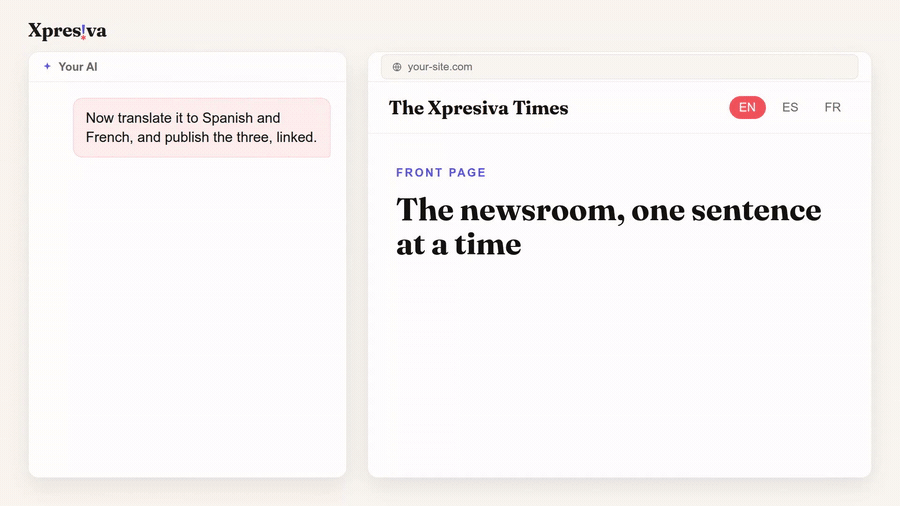

# @oksigenia/ghost-mcp

A [Model Context Protocol](https://modelcontextprotocol.io) server for **Ghost**, aware of the **Xpresiva** theme. Operate your Ghost content by talking to an AI — locally, with no telemetry, straight against your own Ghost.



▶ [Watch the full demo with sound](https://raw.githubusercontent.com/OksigeniaSL/oksigenia-ghost-mcp/master/media/demo.mp4) (48s)

It reuses the [`ghost-md-publisher`](https://github.com/OksigeniaSL/ghost-md-publisher) toolkit, so the MCP and the CLI share the same building blocks: the Admin API client, Markdown → native Ghost cards (callouts, bookmarks, video embeds, image captions), image processing (resize + EXIF clean) and the safe upsert.

## Requirements

- Node.js 20.9+
- A Ghost site with an Admin API key (Settings → Integrations → Add custom integration).

## Install & build

```bash
npm install
npm run build
```

## Configure your MCP client

Point your MCP client at the built server and pass your Ghost credentials as env. Example (Claude Desktop `claude_desktop_config.json`):

```json
{
  "mcpServers": {
    "ghost": {
      "command": "node",
      "args": ["/absolute/path/to/oksigenia-ghost-mcp/dist/index.js"],
      "env": {
        "GHOST_URL": "https://your-site.com",
        "GHOST_ADMIN_API_KEY": "id:secret",
        "GHOST_API_VERSION": "v5.0"
      }
    }
  }
}
```

## Tools

Content ops:

| Tool | Kind | What it does |
|---|---|---|
| `verify_connection` | read | Check the connection and return basic site info. |
| `list_posts` | read | List posts (filter by status/tag). |
| `get_post` | read | Fetch a post by id or slug, with its HTML, tags and authors. |
| `list_tags` | read | List all tags with post counts. |
| `create_post` | write | Create a post from Markdown (draft by default). Processes local images. Stops if the slug already exists. |
| `update_post` | write | Update the post with a given slug (preserves its status). |
| `upload_image` | write | Process and upload a local image, returns the hosted URL. |

Xpresiva-aware:

| Tool | Kind | What it does |
|---|---|---|
| `xpresiva_check_post` | read | Suggestions for a post: valid `custom_template`, feature-image coherence, alt text, excerpt length, reading time. |
| `audit_site` | read | Scan recent posts and flag issues (no feature image, non-Xpresiva template, missing alt, stale drafts). |
| `set_custom_template` | write | Set or clear a post's Xpresiva `custom_template`. |

Multilingual:

| Tool | Kind | What it does |
|---|---|---|
| `publish_translation_set` | write | Create/update several language versions of one article, linked as an Xpresiva translation group (language tag `#es`/`#fr`/… + a shared pairing tag). Does not translate — you provide each version. |

The Markdown accepts the same extras as the CLI: `::video <url>`, `::bookmark <url>` (fetches OpenGraph metadata), and Obsidian-style callouts `> [!warning] ...` → native Ghost cards.

> Note: Ghost's Admin API does not expose the theme's `custom_theme_settings` to integration tokens (it returns 403), so "Xpresiva-aware" means the theme's baked-in conventions (template names, the 7 locales, the pairing-tag scheme), not reading the live theme config. Per-card member/paid visibility of callouts lives in the Ghost editor model, not the HTML, so it isn't set through this server.

### Guardrails

- New posts are created as **drafts** by default.
- `create_post` **never overwrites** an existing slug — it stops and points you to `update_post`.
- No hard-delete tool.
- Everything runs locally against your own Ghost. No telemetry.

## Roadmap

- Scheduling helpers and richer audits.
- Inline local-image handling improvements.

## License

MIT © Oksigenia
